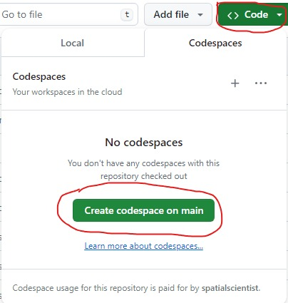
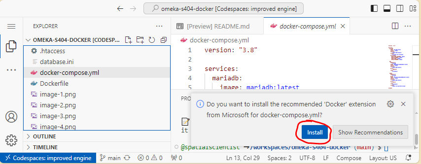
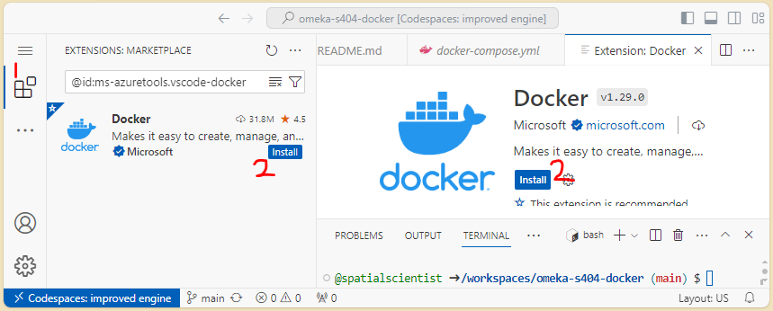
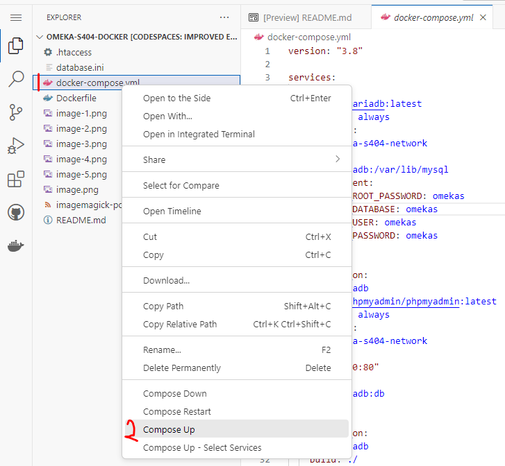
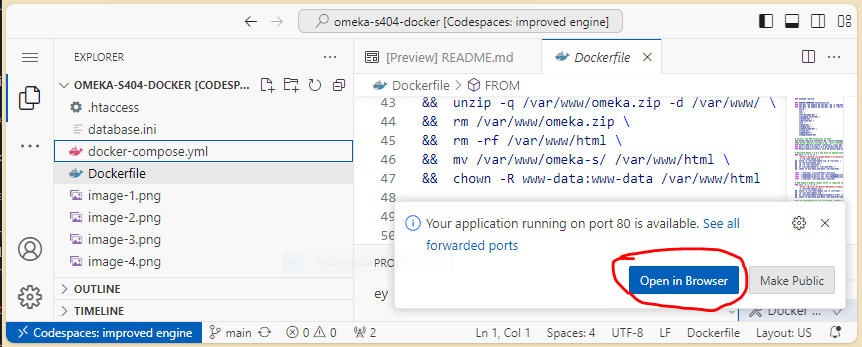
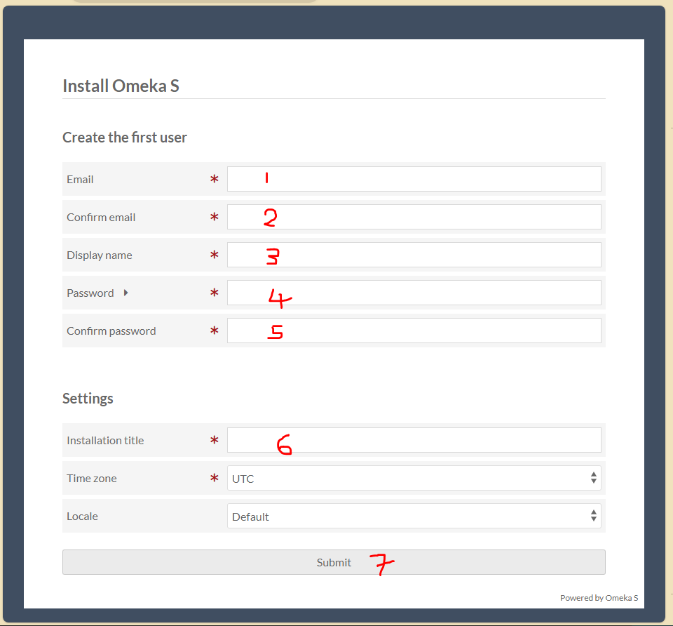
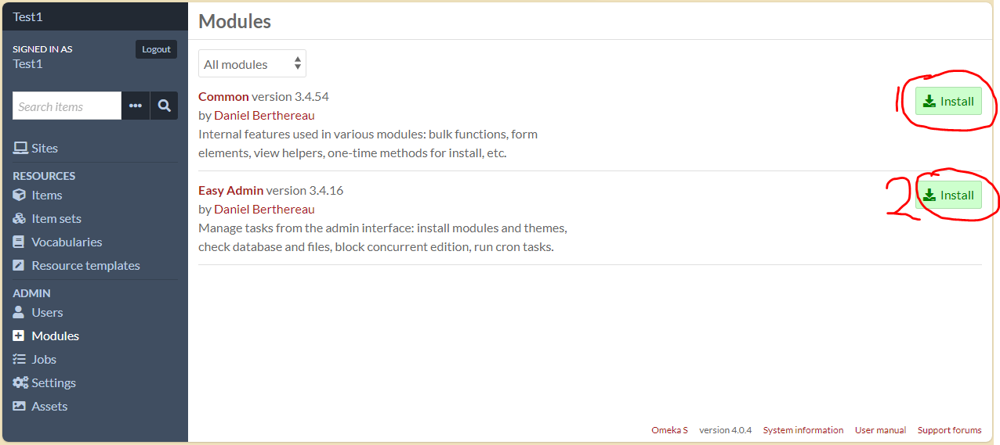

# Omeka-S410 in Docker containers. S410 stands for Omeka S version 4.1.0

This repository contains Docker containers, and additional files, to help you run an [Omeka S](https://github.com/omeka/omeka-s) version [4.1.0](https://github.com/omeka/omeka-s/releases/tag/v4.1.0) instance. There are options to either use Github Codespaces (the simplest) or launch/build the containers using local Visual Studio Code (VSCode) setup or via command line only.

## Launch the containers using Github Codespaces

- Fork this repository

    

- Go to '<> Code' section on your forked repository -> Codespaces -> select 'Create codespace on main'. This will launch a codespace with Visual Studio Code (VSCode) interface if successful

    

- Install 'Docker' extension. 
    - Open the "docker-compose.yml" file. Be alert here as you may get an alert asking you "Do you want to install the recommended 'Docker' extension from Microsoft for docker-composer.yml?" Click the install button to install. For the first time, the installation may take a while so you need patience.

        

    - Go to "Extensions" section to manually install 'Docker' extension if you do not see the alert.

        

- Right-click "docker-compose.yml" file and select 'Compose up'. For the first time, the building may take a while so you need patience.

    

- Hurray! If everything works as expected, you just click 'Open in Browser' button to go to Omeka S 4.1.0 for further details to set it up. 

    

- Fill in the form to setup your Omeka S 4.1.0 instance. 

    

-  Note that as part of this setup, there are:
    - Two modules installed made up of the [Common](https://gitlab.com/Daniel-KM/Omeka-S-module-Common) module and the [EasyAdmin](https://github.com/Daniel-KM/Omeka-S-module-EasyAdmin) module. The "Common" module needs to be installed first before installing the "EasyAdmin" module.
    - Go to the "Module" section to install the two modules.
    - Importance of EasyAdmin module: This module will allow you to install additional Omeka S [themes](https://omeka.org/s/themes/) and or [modules](https://omeka.org/s/modules/).
    - One [default](https://omeka.org/s/themes/default/) theme installed

    

## Launch the containers using VSCode

- Install [VSCode](https://code.visualstudio.com/) and [docker extensions](https://marketplace.visualstudio.com/items?itemName=ms-azuretools.vscode-docker).
- Launch/open VSCode or learn how to use VSCode [here](https://code.visualstudio.com/learn).
- Clone this repository using VSCode. Learn [how to clone and use a GitHub repository in Visual Studio Code](https://docs.microsoft.com/en-us/azure/developer/javascript/how-to/with-visual-studio-code/clone-github-repository?tabs=create-repo-command-palette%2Cinitialize-repo-activity-bar%2Ccreate-branch-command-palette%2Ccommit-changes-command-palette%2Cpush-command-palette).
- Go to VSCode Explorer. You may use "Ctrl + Shift + E" on windows keyboard.
- Option A (If you don't want to build a docker image using the Dockerfile)
    - Right-click "docker-compose.yml" and select "Compose Up". Alternatively, you can use the terminal: ``` docker compose -f "docker-compose.yml" up -d --build ```
- Option B (if you want to build a docker image using the Dockerfile)
    - Right-click on Dockerfile and select "build image". 
    - Enter "omekas410docker:latest" as the image name. Note that this name is used in the docker-compose.yml file.
    - Press enter to build the docker image.
    - Right-click "docker-compose.yml" and select "Compose Up". Alternatively, you can use the terminal: ``` docker compose -f "docker-compose.yml" up -d --build ```
- Go to your browser and type "localhost" for the Omekas410 instance website or use "localhost:8080" for the phpmyadmin interface to manage MySQL database.

## Launch the containers using command line

Install Docker and Docker-compose on your host (can be a physical or virtual machine). 

Download the file "docker-compose.yml".

From the directory containing the "docker-compose.yml" file:

```
$ docker-compose up -d
```
OR
```
$ sudo docker-compose up -d
```
OR
```
$ docker compose -f "docker-compose.yml" up -d --build
```

This will deploy three Docker containers:

- Container 1: mariadb (mysql) 
- Container 2: phpmyadmin (connected to container 1)
- Container 3: omeka-s410 (connected to container 1)

Some useful themes and modules for Omeka S version 3.2.0 are also added. Additional modules could be installed using the EasyInstall module.

With your browser, go to:

- Omeka-s410: http://hostname
- PhpMyAdmin: http://hostname:8080

At that point, you can start configuring your Omeka-S web portal.

Remarks:

- images will be downloaded automatically from the Docker hub: 67911151/omekas410docker:latest, mariadb:latest, phpmyadmin:latest. You may also choose to build the docker image for Omeka S 404 using the name "omekas410docker:latest" instead of using the image on Docker hub. 
- for the omeka-s container, /var/www/html/files (media files uploaded by the users) and /var/www/html/config/database.ini (configuration file with the credentials for the db) are put in a named volume and will survive the removal of the container. The mariadb container also puts the data (omeka-s db in /var/lib/mysql) in a named volume. Volumes are hosted in the host filesystem (/var/lib/docker/volumes).

To stop the containers:

```
$ docker-compose stop
```
OR
```
$ sudo docker-compose stop
```

To remove the containers:
```
$ docker-compose rm 
```
OR
```
$ sudo docker-compose rm 
```

Remark: this will NOT delete the volumes (omeka and mariadb). If you launch again "sudo docker-compose up -d", the volumes will be re-used.

To login into a container:

```
$ sudo docker container exec -it <container-id-or-name> bash 
```

## Build a new image (optional)

If you want to modify the omeka-s image (by changing the Dockerfile file), you will need to build a new image:

E.g.:

```
$ git clone https://github.com/spatialscientist/omeka-s410-docker.git
$ cd omeka-s410-docker
```

Edit the Dockerfile file.

Once done, build the new Docker image:

```
$ sudo docker image build -t foo/omekas410docker:1.0.1-bar .
$ sudo docker image tag foo/omeka-s:1.0.1-bar foo/omekas410docker:latest
```

Upload the image to your Docker hub repository:

Login in your account (e.g. foo) on hub.docker.com, and create a repository "omeka-s410", then upload your customized image:

```
$ sudo docker login --username=foo
$ sudo docker image push foo/omekas410docker:1.0.1-bar
$ sudo docker image push foo/omekas410docker:latest
```
